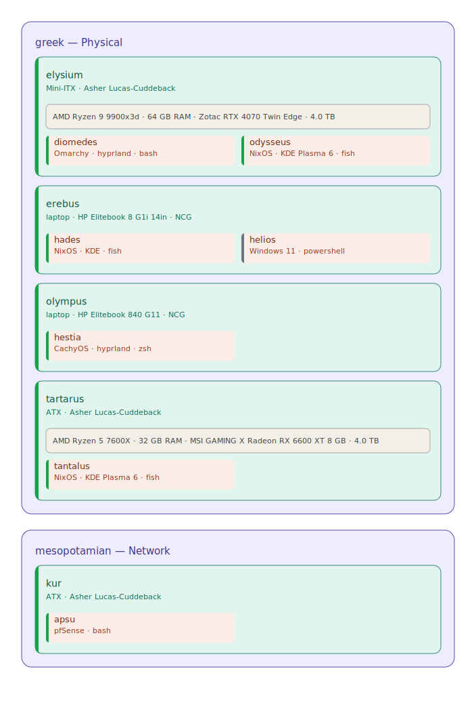

<!-- AUTO-GENERATED — do not edit by hand; run `python inventory/scripts/gen_readme.py` -->
# Inventory

This directory tracks every machine in the fleet. The source of truth is `seed.sql`; `machines.db` and this README are derived from it by the scripts in `scripts/`.

Machines are organised in a three-tier hierarchy:

```
pantheon  →  realm  →  host
  (type)     (device)   (OS environment)
```

Names follow a mythological scheme described in `hostnames.md`. Each pantheon corresponds to a machine type and draws its realm and host names from a different mythology.

## Pantheons

A **pantheon** defines the machine type. Every realm belongs to a pantheon, which determines what kind of infrastructure that realm represents. The name of each pantheon also fixes the mythological pool from which realm and host names are drawn.

| Pantheon | Type | Description |
| --- | --- | --- |
| egyptian | Cloud | Cloud and remote instances. Egyptian mythology is structured around Ma'at (cosmic order) and the sun's nightly journey through the Duat. Well-suited for remote systems that are always running but seldom touched directly. Realm names come from sacred Egyptian places (Aaru, Duat, Iunu …); host names from gods of the solar cycle. |
| greek | Physical | Physical machines. Greek cosmology spans the full physical spectrum from the heights of Olympus to the depths of Tartarus — each realm a distinct, grounded domain. Realm names are drawn from Greek cosmological locations (Olympus, Erebus, Elysium, Tartarus …); host names are drawn from the gods and heroes who inhabit them. |
| mesopotamian | Network | Network devices. The oldest written mythology — Sumerian and Akkadian gods govern the fundamental forces of the world. Appropriate for the infrastructure that underpins everything else. Realm names are the first cities and cosmic regions (Eridu, Dilmun, Kur …); host names from the primordial gods and heroes. |
| norse | VM | Virtual machines. The nine worlds of Norse cosmology hang from Yggdrasil, the world-tree. Each realm is a distinct but interconnected domain — a natural fit for VMs that share underlying hardware. Realm names come from the nine worlds (Asgard, Midgard, Jotunheim …); host names from the gods, heroes, and beings who dwell there. |
| roman | Container | Containers. Roman gods mirror their Greek counterparts but carry a more civic, martial, and administrative character — appropriate for ephemeral workloads that serve a larger system. Realm names are the seven hills of Rome; host names are drawn from the Roman pantheon and their civic virtues. |

## Realms

A **realm** represents a physical or logical device. It belongs to a pantheon (and therefore a type), carries hardware and ownership metadata, and can host one or more OS environments. The realm name comes from a location within its pantheon's mythology — for example, `erebus` and `elysium` are both locations in the Greek underworld, housed under the `greek` (physical) pantheon.

| Realm | Pantheon | Owner | Form Factor | Hardware | Status |
| --- | --- | --- | --- | --- | --- |
| elysium | greek | Asher Lucas-Cuddeback | Mini-ITX | AMD Ryzen 9 9900x3d  ·  64 GB RAM  ·  Zotac RTX 4070 Twin Edge  ·  4.0 TB | active |
| erebus | greek | NCG | laptop | HP Elitebook 8 G1i 14in | active |
| olympus | greek | NCG | laptop | HP Elitebook 840 G11 | active |
| tartarus | greek | Asher Lucas-Cuddeback | ATX | AMD Ryzen 5 7600X  ·  32 GB RAM  ·  MSI GAMING X Radeon RX 6600 XT 8 GB  ·  4.0 TB | active |
| kur | mesopotamian | Asher Lucas-Cuddeback | ATX | — | active |

## Hosts

A **host** represents a specific OS environment running on a realm. Multiple hosts can share a realm (dual-boot, replaced installs). A host's full context is resolved by walking up to its realm and then its pantheon. Host names are drawn from the gods, heroes, or beings native to their realm's mythology — so `hades` lives on `erebus` (Greek underworld) under the `greek` pantheon, and `odysseus` lives on `elysium` (Greek paradise) under the same.

| Host | Realm | OS | WM | Shell | User | Status |
| --- | --- | --- | --- | --- | --- | --- |
| diomedes | elysium | Omarchy | hyprland | bash | asher | active |
| hestia | elysium | CachyOS | hyprland | zsh | asherl | active |
| odysseus | elysium | NixOS | KDE Plasma 6 | fish | alucascu | active |
| hades | erebus | NixOS | KDE | fish | alucascu | active |
| helios | erebus | Windows 11 | — | powershell | ncgmail/alucascuddeback | unprovisioned |
| apsu | kur | pfSense | — | bash | admin | active |
| tantalus | tartarus | NixOS | KDE Plasma 6 | fish | alucascu | active |


> **`helios`** is unprovisioned — the OS has been wiped and awaits reinstall.

## Restic Backup Paths

Hosts that carry restic backup configuration. `restic_local` is a repository on the host's own filesystem; `restic_ssd` is a repository on an attached external SSD.

| Host | Local repo | SSD repo |
| --- | --- | --- |
| diomedes | /home/asher/.local/restic | /run/media/asher/Extreme SSD/restic/ |
| hestia | /home/asherl/.local/restic-repo/ | /run/media/asherl/Extreme SSD/restic/ |
| hades | /home/alucascu/.local/restic-repo/ | /run/media/alucascu/Extreme SSD/restic/ |

## Status Values

| Status | Meaning |
| --- | --- |
| active | In regular use. |
| dormant | Functional but seldom used. |
| unprovisioned | OS wiped or never installed; awaiting provisioning. |
| decommissioned | Permanently out of service. |

## Containment Diagram

Auto-generated from `machines.db` by `scripts/gen_containment.py`. Shows the full pantheon → realm → host hierarchy at a glance.


